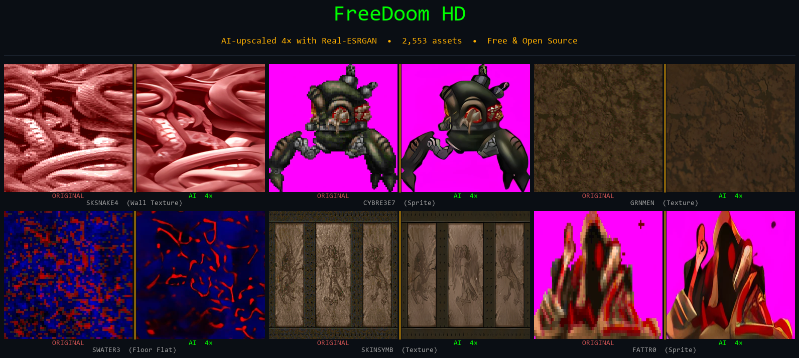
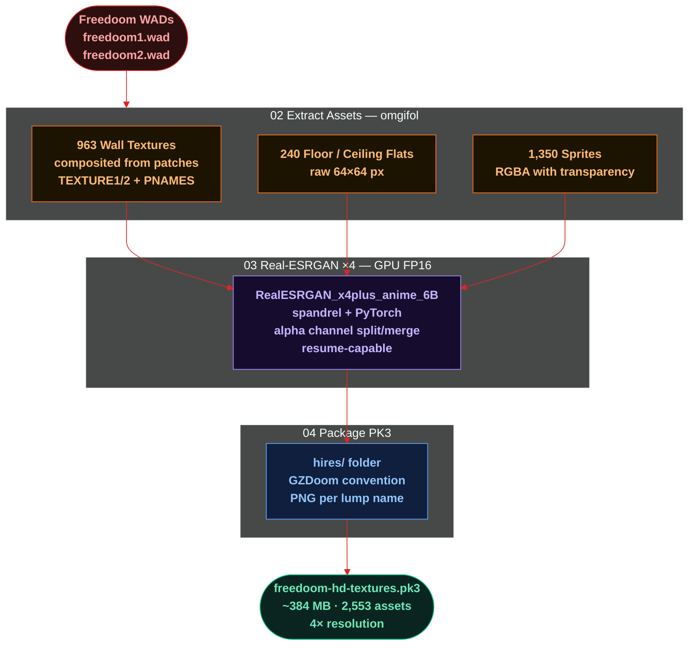

# FreeDoom HD

> AI-upscaled 4× texture pack for Freedoom — free, open source, drop-in for GZDoom.



---

## What is this?

**FreeDoom HD** takes every visual asset from [Freedoom](https://freedoom.github.io/) — 963 wall textures, 240 floor/ceiling flats, and 1,350 sprites — and upscales them 4× using [Real-ESRGAN](https://github.com/xinntao/Real-ESRGAN), a state-of-the-art AI super-resolution model. The result is packaged as a GZDoom-compatible `.pk3` file you can drop straight into your source port.

| | Original | After AI upscale |
|---|---|---|
| Wall textures | 64×128 px | 256×512 px |
| Floor/ceiling flats | 64×64 px | 256×256 px |
| Sprites | ~30–200 px | ~120–800 px |
| **Total assets** | **2,553** | **2,553** |

---

## Download

**[→ Download freedoom-hd-textures.pk3](https://github.com/m4cd4r4/freedoom-hd/releases/latest/download/freedoom-hd-textures.pk3)** (~384 MB)

---

## Quick Start

```bash
# Command line
gzdoom -iwad freedoom2.wad -file freedoom-hd-textures.pk3

# Or just drag the .pk3 onto gzdoom.exe
```

Requires GZDoom (or any ZDoom-based source port) and Freedoom WADs.
Full install guide: [Install Guide →](#install-guide)

---

## Compatibility

| Source port | Supported |
|---|---|
| GZDoom | ✅ Recommended |
| LZDoom | ✅ |
| Zandronum | ✅ |
| Other ZDoom ports | ✅ |

Works with: Freedoom Phase 1 & 2, DOOM (shareware & full), DOOM II, community WADs.

---

## How It Was Built

The entire pipeline is reproducible and included in this repo.

### 1. Download Freedoom

```bash
cd pipeline
python 01_download_freedoom.py
```

Downloads `freedoom1.wad` and `freedoom2.wad` from the official GitHub releases.

### 2. Extract Assets

```bash
python 02_extract_assets.py
```

Uses [omgifol](https://github.com/devinacker/omgifol) to extract all visual assets as PNGs:
- **Flats**: raw 64×64 pixel data
- **Sprites**: RGBA with transparency
- **Wall textures**: composited from patches using `TEXTURE1`/`TEXTURE2` + `PNAMES` definitions

### 3. Upscale with Real-ESRGAN

```bash
python 03_upscale_assets.py
```

Uses [spandrel](https://github.com/chaiNNer-org/spandrel) + PyTorch to load the `RealESRGAN_x4plus_anime_6B` model. The anime_6B variant handles stylized/illustrated content better than the general-purpose model. Runs on GPU with FP16 for speed.

- Sprite transparency (alpha channel) is handled by upscaling RGB and alpha separately, then applying a binary threshold to prevent edge haloing
- Resume-capable: skips already-upscaled files

### 4. Package PK3

```bash
python 04_package_pk3.py
```

Assembles a GZDoom hi-res texture pack. GZDoom's `hires/` folder convention: any PNG in `hires/<LUMPNAME>.png` automatically replaces the original lump at full resolution.

### 5. Or run everything at once

```bash
python run_all.py
```

---

## Build Pipeline



---

## Install Guide

### GZDoom

**Option A — Drag and drop**
Drag `freedoom-hd-textures.pk3` onto `gzdoom.exe`. When prompted, select your Freedoom WAD.

**Option B — Command line**
```bash
gzdoom -iwad freedoom2.wad -file freedoom-hd-textures.pk3
```

**Option C — Auto-load (permanent)**
Place the `.pk3` in your GZDoom directory, then add it via
`Options → Miscellaneous Options → Autoload`.

### LZDoom / Zandronum
Same as GZDoom — command line or drag & drop.

---

## Requirements (to rebuild)

```
Python 3.10+
PyTorch (CUDA recommended)
pip install omgifol spandrel Pillow opencv-python-headless tqdm requests numpy<2
```

GPU with 4GB+ VRAM recommended. Tested on Nvidia Quadro RTX 5000 (16GB).
Full pipeline takes ~15–45 minutes depending on GPU.

---

## Project Structure

```
freedoom-hd/
├── pipeline/
│   ├── config.py                # Paths, model settings
│   ├── 01_download_freedoom.py  # Download WADs
│   ├── 02_extract_assets.py     # WAD → PNG extraction
│   ├── 03_upscale_assets.py     # Real-ESRGAN 4× upscaling
│   ├── 04_package_pk3.py        # Assemble GZDoom PK3
│   ├── 05_generate_previews.py  # Before/after comparison images
│   ├── run_all.py               # Run full pipeline
│   └── requirements.txt
├── website/                     # Next.js distribution site
├── docs/
│   └── banner.png
├── .gitignore
└── README.md
```

---

## License

The pipeline code in this repo is **MIT licensed**.

The upscaled texture assets are derived from [Freedoom](https://freedoom.github.io/), which is licensed under the [BSD 3-Clause License](https://github.com/freedoom/freedoom/blob/master/COPYING.adoc). The upscaled assets carry the same BSD license.

The Real-ESRGAN model weights are licensed under [BSD 3-Clause](https://github.com/xinntao/Real-ESRGAN/blob/master/LICENSE).

---

## Credits

- [Freedoom](https://freedoom.github.io/) — the free, open-source Doom-compatible game
- [Real-ESRGAN](https://github.com/xinntao/Real-ESRGAN) — AI super-resolution
- [spandrel](https://github.com/chaiNNer-org/spandrel) — model loader
- [omgifol](https://github.com/devinacker/omgifol) — WAD manipulation library
- [GZDoom](https://zdoom.org/) — source port with hi-res texture support
